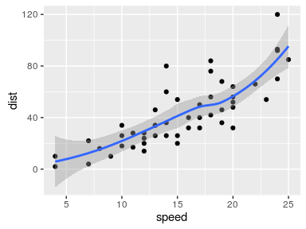

R code chunks
=============

Writing R markdown, you can insert R code chunks including plots:

    # quick summary and plot
    library(ggplot2)
    summary(cars)

    ##      speed           dist       
    ##  Min.   : 4.0   Min.   :  2.00  
    ##  1st Qu.:12.0   1st Qu.: 26.00  
    ##  Median :15.0   Median : 36.00  
    ##  Mean   :15.4   Mean   : 42.98  
    ##  3rd Qu.:19.0   3rd Qu.: 56.00  
    ##  Max.   :25.0   Max.   :120.00

    qplot(speed,dist,data=cars)+
            geom_smooth()

  
 Table

    knitr::kable(cars$dist)

<table>
<tbody>
<tr class="odd">
<td align="right">2</td>
</tr>
<tr class="even">
<td align="right">10</td>
</tr>
<tr class="odd">
<td align="right">4</td>
</tr>
<tr class="even">
<td align="right">22</td>
</tr>
<tr class="odd">
<td align="right">16</td>
</tr>
<tr class="even">
<td align="right">10</td>
</tr>
<tr class="odd">
<td align="right">18</td>
</tr>
<tr class="even">
<td align="right">26</td>
</tr>
<tr class="odd">
<td align="right">34</td>
</tr>
<tr class="even">
<td align="right">17</td>
</tr>
<tr class="odd">
<td align="right">28</td>
</tr>
<tr class="even">
<td align="right">14</td>
</tr>
<tr class="odd">
<td align="right">20</td>
</tr>
<tr class="even">
<td align="right">24</td>
</tr>
<tr class="odd">
<td align="right">28</td>
</tr>
<tr class="even">
<td align="right">26</td>
</tr>
<tr class="odd">
<td align="right">34</td>
</tr>
<tr class="even">
<td align="right">34</td>
</tr>
<tr class="odd">
<td align="right">46</td>
</tr>
<tr class="even">
<td align="right">26</td>
</tr>
<tr class="odd">
<td align="right">36</td>
</tr>
<tr class="even">
<td align="right">60</td>
</tr>
<tr class="odd">
<td align="right">80</td>
</tr>
<tr class="even">
<td align="right">20</td>
</tr>
<tr class="odd">
<td align="right">26</td>
</tr>
<tr class="even">
<td align="right">54</td>
</tr>
<tr class="odd">
<td align="right">32</td>
</tr>
<tr class="even">
<td align="right">40</td>
</tr>
<tr class="odd">
<td align="right">32</td>
</tr>
<tr class="even">
<td align="right">40</td>
</tr>
<tr class="odd">
<td align="right">50</td>
</tr>
<tr class="even">
<td align="right">42</td>
</tr>
<tr class="odd">
<td align="right">56</td>
</tr>
<tr class="even">
<td align="right">76</td>
</tr>
<tr class="odd">
<td align="right">84</td>
</tr>
<tr class="even">
<td align="right">36</td>
</tr>
<tr class="odd">
<td align="right">46</td>
</tr>
<tr class="even">
<td align="right">68</td>
</tr>
<tr class="odd">
<td align="right">32</td>
</tr>
<tr class="even">
<td align="right">48</td>
</tr>
<tr class="odd">
<td align="right">52</td>
</tr>
<tr class="even">
<td align="right">56</td>
</tr>
<tr class="odd">
<td align="right">64</td>
</tr>
<tr class="even">
<td align="right">66</td>
</tr>
<tr class="odd">
<td align="right">54</td>
</tr>
<tr class="even">
<td align="right">70</td>
</tr>
<tr class="odd">
<td align="right">92</td>
</tr>
<tr class="even">
<td align="right">93</td>
</tr>
<tr class="odd">
<td align="right">120</td>
</tr>
<tr class="even">
<td align="right">85</td>
</tr>
</tbody>
</table>
