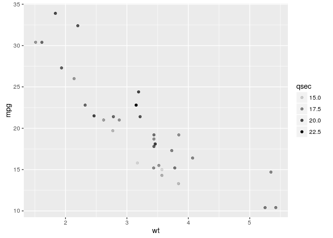
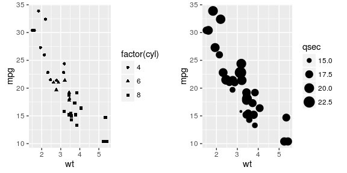

ggplot practice
===============

    library(ggplot2)
    library(datasets)
    head(diamonds,3)

    ##   carat     cut color clarity depth table price    x    y    z
    ## 1  0.23   Ideal     E     SI2  61.5    55   326 3.95 3.98 2.43
    ## 2  0.21 Premium     E     SI1  59.8    61   326 3.89 3.84 2.31
    ## 3  0.23    Good     E     VS1  56.9    65   327 4.05 4.07 2.31

    head(cars,3)

    ##   speed dist
    ## 1     4    2
    ## 2     4   10
    ## 3     7    4

    ## qplot
    qplot(clarity,data=diamonds,fill=cut,geom="bar")

  

    ## ggplot histogram
    ggplot(diamonds,aes(clarity,fill=cut))+geom_bar()

  

    qplot(wt,mpg,data=mtcars)

  

    qplot(log(wt),mpg-10,data=mtcars)

  

    qplot(wt,mpg,data=mtcars,color=qsec)

  

    # change size of points (hint: color/colour, hint: set aesthetic/mapping)
    qplot(wt, mpg, data=mtcars, color=qsec, size=3)

  

    qplot(wt, mpg, data=mtcars, colour=qsec, size=I(3))

  

    # use alpha blending
    qplot(wt, mpg, data=mtcars, alpha=qsec)

  

    library(gridExtra)
    head(mtcars,3)

    ##                mpg cyl disp  hp drat    wt  qsec vs am gear carb
    ## Mazda RX4     21.0   6  160 110 3.90 2.620 16.46  0  1    4    4
    ## Mazda RX4 Wag 21.0   6  160 110 3.90 2.875 17.02  0  1    4    4
    ## Datsun 710    22.8   4  108  93 3.85 2.320 18.61  1  1    4    1

    p1=qplot(wt,mpg,data=mtcars,colour=cyl)
    levels(mtcars$cyl)

    ## NULL

    p2=qplot(wt,mpg,data=mtcars,colour=factor(cyl))
    grid.arrange(p1,p2,ncol=2)

  

    library(gridExtra)
    head(mtcars,3)

    ##                mpg cyl disp  hp drat    wt  qsec vs am gear carb
    ## Mazda RX4     21.0   6  160 110 3.90 2.620 16.46  0  1    4    4
    ## Mazda RX4 Wag 21.0   6  160 110 3.90 2.875 17.02  0  1    4    4
    ## Datsun 710    22.8   4  108  93 3.85 2.320 18.61  1  1    4    1

    p1=qplot(wt,mpg,data=mtcars,colour=cyl)
    levels(mtcars$cyl)

    ## NULL

    p2=qplot(wt,mpg,data=mtcars,colour=factor(cyl))
    grid.arrange(p1,p2,ncol=2)

